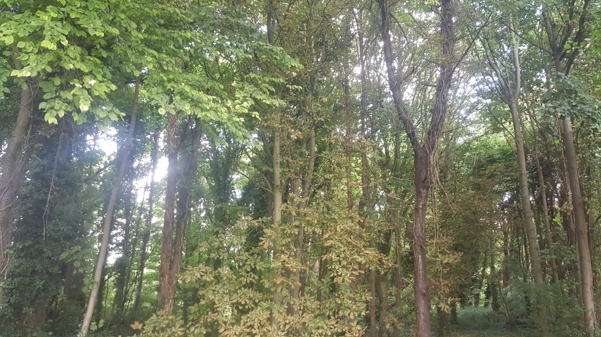

# meditator

[](https://www.gnu.org/licenses/gpl-3.0.html)


## Introduction

Miscellaneous tools for meditation and mental health. Optionally a very basic R package for meditation and mental health.


## Installation

Install R

Open R and type the following commands:

```r
install.packages(devtools)
library(devtools)
devtools::install_github("jacobkap/meditations")
devtools::install_github("jfisher-usgs/meditate")
```

or

```r

install.packages('devtools')
library(devtools)
devtools::install_github('neelsoumya/meditator')

```

## Usage

Clone the repository. Go to your Terminal and type the following command:

```r

git clone https://github.com/neelsoumya/meditator

```

In R, type the following commands

```r
library(meditations)
library(meditate)

meditations::meditations()

meditate::Meditate()

```

or

From the Terminal, type the following commands

```r
R --no-save < meditator.R

```

or

run the following shell script once you have cloned the repository

```r

chmod 755 meditator.sh

./meditator.sh

```

## Shiny app

A shiny app for this is available here:

https://sb2333medschl.shinyapps.io/meditator/


## Animations

https://ncase.me/neurons/

https://ncase.me/mental-health/#toc_18

https://ncase.me/anxiety/


## Other resources

https://www.software.ac.uk/blog/2022-03-02-how-mindfulness-and-inclusivity-help-software-sustainability

https://www.software.ac.uk/blog/2021-12-14-mental-health-research-software-engineering

https://ncase.me/neurons/

https://ncase.me/mental-health/#toc_18

https://ncase.me/anxiety/


## Smartphone app for meditation

https://plumvillage.app/

https://plumvillage.app/calm-and-ease-one-of-the-most-liked-guided-meditations-on-the-app/

## Inspiration

https://web.archive.org/web/20230315092923/https://www.bu.edu/quantum/zen/readings/bonadgeNisargadatta.html

https://web.archive.org/web/20230317100636/https://www.bu.edu/quantum/zen/readings/greatWayTarrant.html

## Acknowledgements

https://github.com/jfisher-usgs/meditate

https://github.com/jacobkap/meditations


## Contact

Marcus Aurelius

Seneca

Swami Vivekananda

Lao Tse

Current whereabouts of the aforementioned people unknown.

Read Tao Te Ching by Lao Tse

https://www.gutenberg.org/ebooks/216

The Ten Bulls 

https://www.buddhistdoor.com/OldWeb/passissue/9710/sources/art9.htm

Blessings to you, wherever and whoever you are.


<!---->


[](https://www.gnu.org/licenses/gpl-3.0.html)

